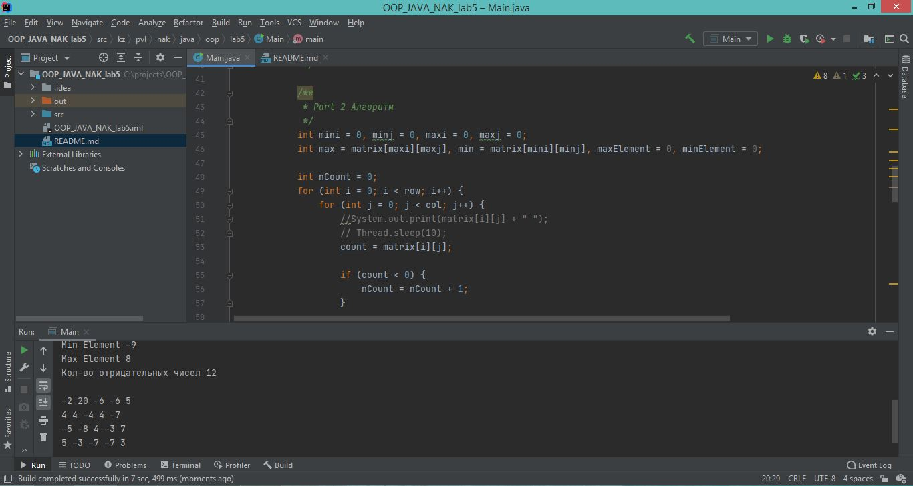

## Лабораторная работа №5 JAVA_OOP

---
__Задание:__ _Подсчитать количество отрицательных элементов в таблице и
увеличить на это значение минимальный и максимальный элементы таблицы_

__Работа с Preferences API:__

---
__Screenshot:__
;